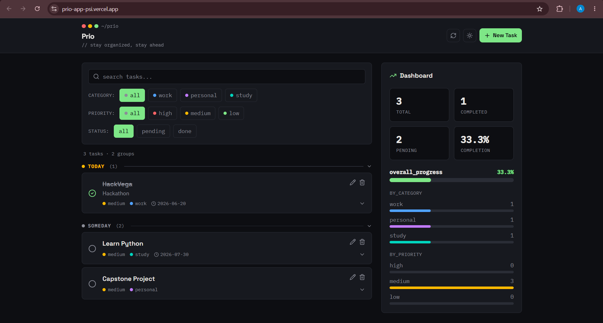
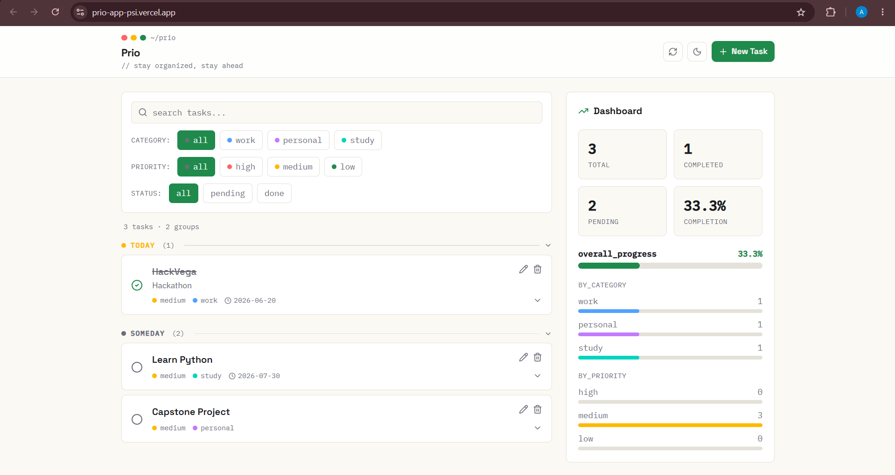
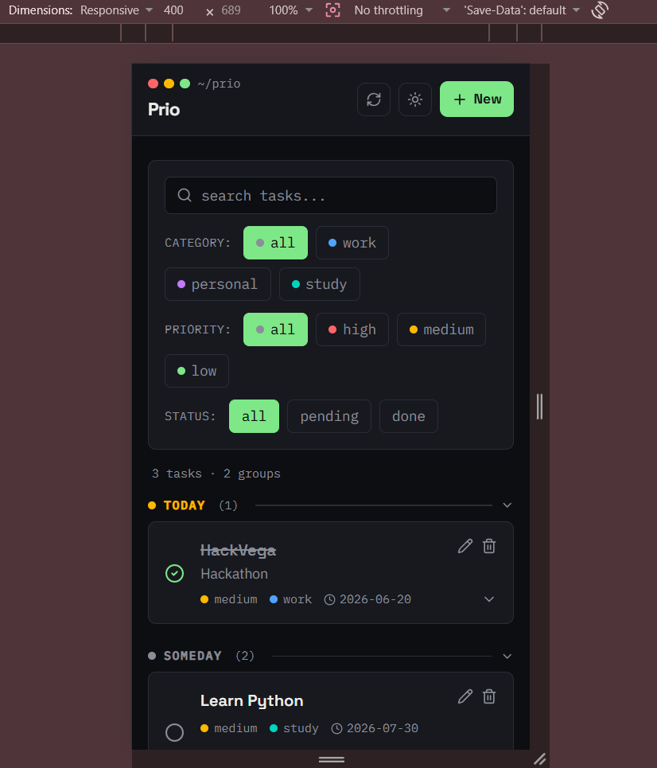
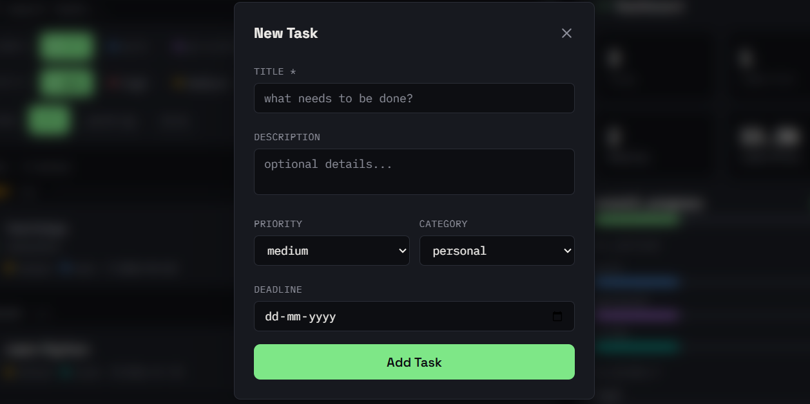
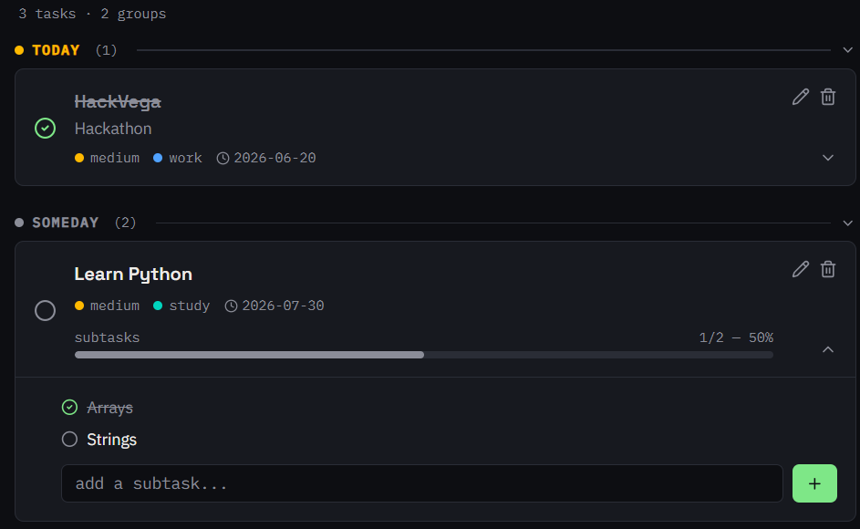

# Prio — Task Manager

A full-stack task management app with priority tracking, deadline-based grouping, subtasks, and a live dashboard — built to go beyond basic CRUD.

**Live app:** [prio-app-psi.vercel.app](https://prio-app-psi.vercel.app/)

> ⚠️ The backend runs on Render's free tier, which spins down after inactivity. The first request after idle time may take 30–60 seconds to respond. Subsequent requests are fast.

---

## Screenshots

### Dashboard — Dark Mode


### Dashboard — Light Mode


### Mobile View


### Add Task


### Subtasks with Progress Tracking


---

## Features

- **Smart task grouping** — tasks automatically sorted into Overdue, Today, Upcoming, and Someday based on deadline
- **Subtasks with progress bars** — break tasks into steps, track completion percentage per task
- **Priority & category system** — High/Medium/Low priority, Work/Personal/Study categories, color-coded throughout
- **Search & multi-filter** — filter by category, priority, and completion status simultaneously
- **Dark/light mode** — persisted across sessions via localStorage
- **Live dashboard** — completion stats, category/priority breakdowns, overall progress bar
- **Overdue alerts** — header badge shows overdue task count at a glance
- **Smooth animations** — Framer Motion transitions on add/delete/expand

---

## Tech Stack

| Layer | Technology |
|---|---|
| Frontend | React, Vite, Tailwind CSS, Framer Motion |
| Backend | FastAPI (Python) |
| Database | PostgreSQL (hosted on Neon) |
| ORM | SQLAlchemy |
| Deployment | Vercel (frontend), Render (backend) |

---

## Architecture

- RESTful API with full CRUD for tasks and subtasks
- CORS-secured cross-origin requests between frontend and backend
- Environment-based config — no secrets committed to source

---

## Local Setup

### Backend

```bash
cd backend
python -m venv venv
source venv/bin/activate   # Windows: venv\Scripts\activate
pip install -r requirements.txt
```

Create `backend/.env`: